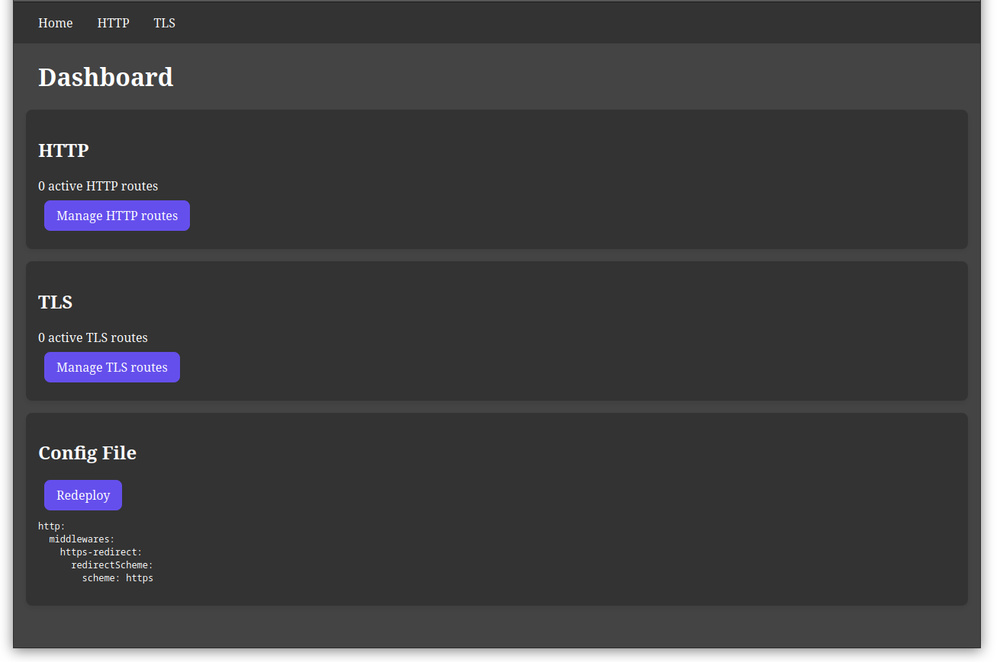
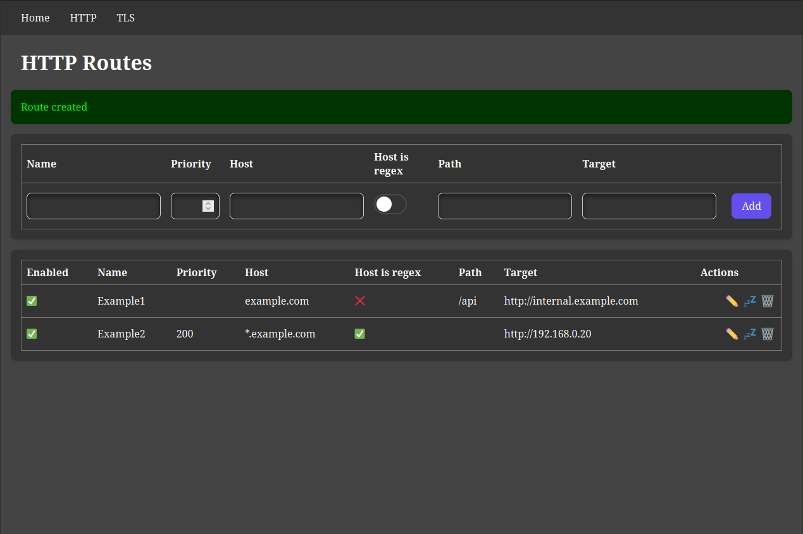
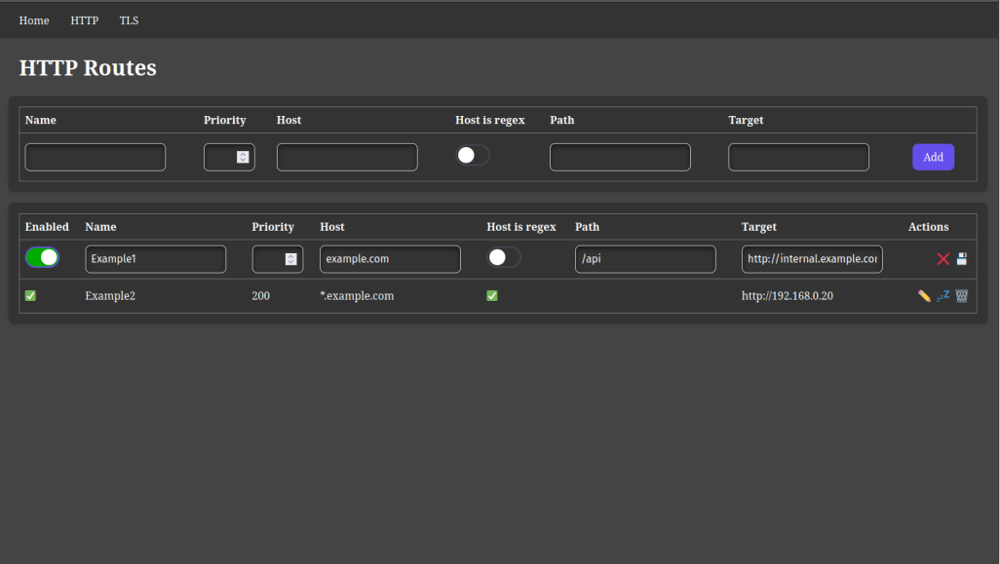
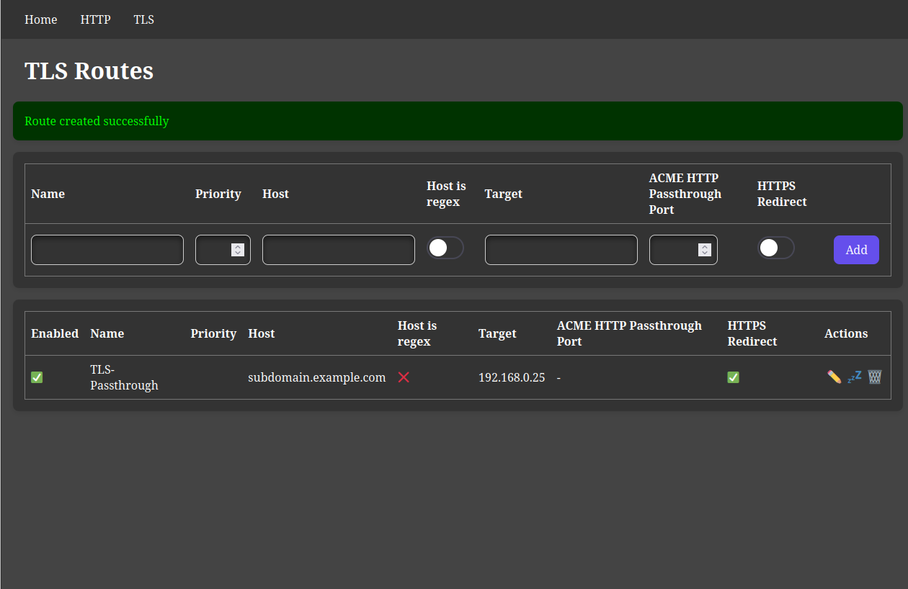

# Traefik GUI

I really like traefik, but with multiple VMs I need to bind come configs into the container so I can relay those connections.

So I built this little GUI to configure some basic routes. It doesn't offer any advanced functions, but it's all I need

If you need any help, feel free to create an issue.

## Screenshots

